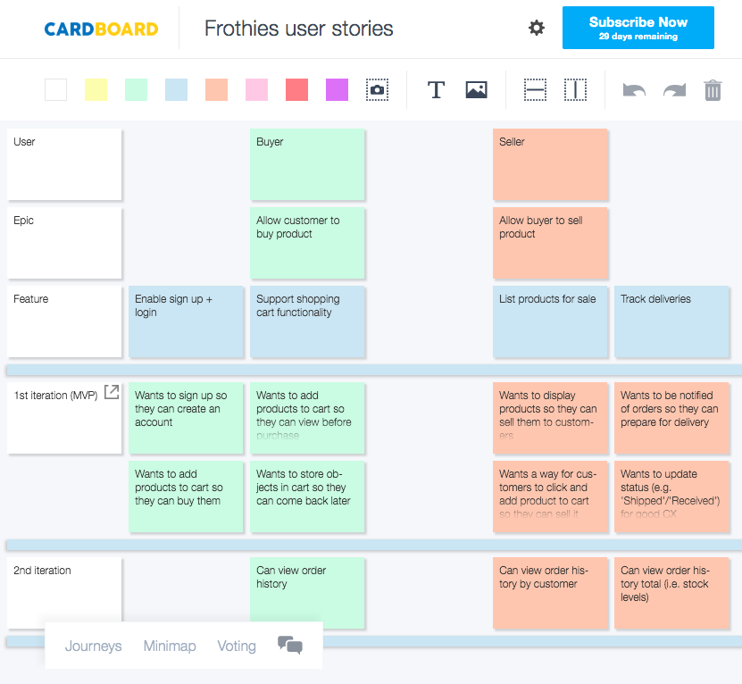
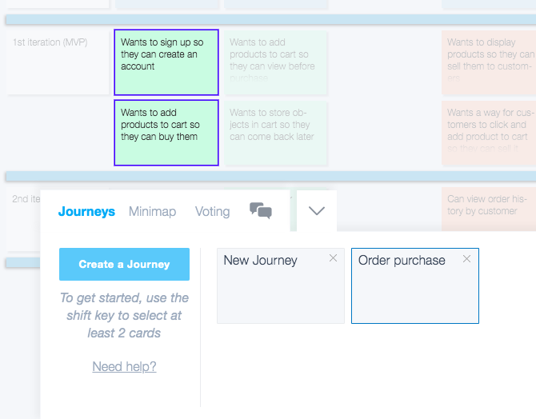

# README

# Rails app 
This rails app was created as part of assessment for Coder Academy Fasttrack Bootcamp over two weeks in April, 2019. 

Trello: https://trello.com/b/bqhyTEfY

Heroku site: https://enigmatic-shelf-88976.herokuapp.com/

Github repo: https://github.com/rastko909/frothies

Figma moodboard and wireframes: https://www.figma.com/file/aPgYx1QKRcH5hHLC6htyxhyK/Frothies?node-id=24%3A0

Google slides User Personas: https://docs.google.com/presentation/d/1MiDaYOKiY3vW1_pMVOsPU4bY29DUTXa0rsX3hkpEaX4/edit?usp=sharing

Cardboard User Stories: https://app.cardboardit.com/maps/guests/f9c1bdb994a2426b642e43ccab0b20034ce0e5109cab39e661aa8c13424756b4

# Short answer questions
## 1. What is the need (i.e. challenge) that you will be addressing in your project?

## 2. Identify the problem you’re trying to solve by building this particular marketplace App? Why is it a problem that needs solving?

## 3. Describe the project will you be conducting and how. your App will address the needs.

## 4. Describe the network infrastructure the App may be based on.

## 5. Identify and describe the software to be used in your App.

## 6. Identify the database to be used in your App and provide a justification for your choice.

## 7. Identify and describe the production database setup (i.e. postgres instance).

## 8. Describe the architecture of your App.

## 9.Explain the different high-level components (abstractions) in your App.

## 10.Detail any third party services that your App will use.

## 11.Describe (in general terms) the data structure of marketplace apps that are similar to your own (e.g. eBay, Airbnb).

## 12.Discuss the database relations to be implemented.

## 13.Describe your project’s models in terms of the relationships (active record associations) they have with each other.

## 14.Provide your database schema design.

## 15.Provide User stories for your App.

## 16.Provide Wireframes for your App.

## 17. Describe the way tasks are allocated and tracked in your project.

*Communication channel in slack*

## 18. Discuss how Agile methodology is being implemented in your project.

We used Agile methodology concepts in several ways, including
- Kanban (Trello)
- Scrum framework
- User story mapping

**Kanban**

We maintained an agile (Kanban) board on Trello for project management with cards, columns, work-in-progress limits (3 for In Progress column), a backlog that we groomed, and a delivery point throughout the project. 

For the first four days, we're using Kanban, and for the 5th to the 8th day, we plan to use Scrum while keeping our backlog (i.e. 'Scrumban'). 

Screenshots of the Kanban are shown throughout our planning notes after this short answer question section. 

During the scrum, we plan to
- prioritise tasks from our backlog
- do sprint planning as a group
- have two shipped epics as our scrum goals
- do one sprint
- do retrospectives at the end of each day since our sprint is only five days long.

We created User stories early in the project as part of our planning and will use these during the sprint to complete features we haven't done. These were done with
- Our two users (Buyer and seller)
- One epic for each user (allow customer to buy and allow buyer to sell respectively)
- Features (e.g. enable sign up and login, list products for sale)
- User stories (e.g. As a buyer, I want to sign up so I can create an account)

*User story mapping using Cardboard.io*

We also followed customer journeys using the cards and inbuilt function in the site. One customer jouney is shown in the screenshot below.

*Example customer journey from user story map*

While we attempted to use the scrum framework, we didn't have the formal roles from agile such as scrum master, instead sharing these roles fluidly between us.

We used the concept of User stories and User story mapping but we didn't strictly measure velocity as this sprint was for this one project and would not be repeated with the same development team again.

## 19. Provide an overview and description of your Source control process.

## 20. Provide an overview and description of your Testing process.

We agreed to use Minitest since it is the default for Ruby libraries. 

RSpec

Stress test

## 21. Discuss and analyse requirements related to information system security.

## 22. Discuss methods you will use to protect information and data.

## 23. Research what your legal obligations are in relation to handling user data.

# Day 1

**Morning plan**

- JP + RB go through test app deployment / Stripe / Cancan / Devise
- GW set up Trello w/Rubric

**Middle of day check in**

Meeting to agree on MVP / roles / day 1 and 2 plan
- Completed basic wireframes on board (see screenshot)
  - Home pages (same for all users)
    - Pop up w/age check
    - Landing page
  - Login page 
    - has sign up option
    - asks if buyer or seller
  - Buyer home page
  - Seller dashboard
  - Admin dashboard
- Agreed on accounts required for MVP (Buyer, Seller, Admin, Guest)
- Agreed on Day 1 + 2 plan
  - GW do Readme/Trello
  - JP do research on screenshots
  - RB do ERD
Photo of Day 1 meeting board

Trello at start of Day 1

**Schema design**

RB worked on the schema more and completed the ERD. The ERD changed during the day as we refined the schema design, as shown in the screenshots comparing the start of the day and the end of the day.

*Screenshots of ERD at start of Day 2*

*Screenshots of ERD at end of Day 2*

*Trello at end of Day 1*

*Screenshot of migrating and implementing bootstrap*

*Heroku home page deployed at end of Day 1*

# Day 2

**Morning check in**

Group agrees
- RB had updated the ERD overnight and wanted to continue, so he'll work on that for the morning. 
- GW to update Trello after check in, complete linking cards in Trello and check requirements are on track 
- JP continuing research for wireframes
- group completed WIP and gave following update:

Notes from WIP and morning plan

*Screenshot of Day 2 morning planning using Kanban backlog*

*Trello board at start of Day 2*

**Debugging**
We continued adding to the controllers and models. We did debugging throughout the day. 

*Example of debugging*

**Wireframes**
We completed wireframes for two devices and agreed to design for mobile first, so started with those once in Figma. 

After agreeing on the colour scheme and feel we wanted for the brand, JP created a moodboard then moved onto wireframes. 

Changes:
We discussed UI design and made a few changes, namely
- moving icons for navigation to bottom of mobile UI so that there was more space between them and they were in the hot zone
- moving nav pane on desktop to all be on the same side rather than on two sides to reduce visual clutter, make the information hierarchy more obvious and keep the UI clean

*Lo-fi wireframes*

*Figma moodboard*

*Wireframes in Figma*

Wireframes for mobile were completed first, as we agreed that designing for mobile-first was the best option for our users and for the wider trend in society preferencing mobile use.

*Screenshot of mobile wireframes*

Wireframes for desktop were completed next, as our sellers would most likely operate from desktop at least some of the time, as might buyers.

*Screenshot of desktop wireframes*

By the end of day 2, we completed all our tasks as agreed in the morning and midday check ins. 

*Screenshot of End of day 2 Trello card*

*Start of Day 3 trello*

**Day 3 priorities**
1. Be able to retrieve objects and complete one transaction, deploy to Heroku
2. Start work on short answer questions
If done early, then: 
- Testing
- Stripe
- CanCan

**Middle of day update**
1. Objects can be retrieved
2. We've started on short answer questions and will do more together as a group starting after lunch
   Other:
   - we've researched testing and will start with minitest
   - we've got wireframes for two devices, now working on a third

**Wireframes**
Wireframes were completed for a third device—iPad.

*Screenshot of iPad wireframes*

FROM DEFAULT TO UPDATE IF NOT DONE ELSEWHERE

Things you may want to cover:

* Ruby version
UPDATE
* System dependencies
UPDATE
* Configuration
UPDATE
* Database creation
UPDATE
* Database initialization
UPDATE
* How to run the test suite
UPDATE
* Services (job queues, cache servers, search engines, etc.)
LEAVE?
* Deployment instructions
UPDATE
* ...