# README

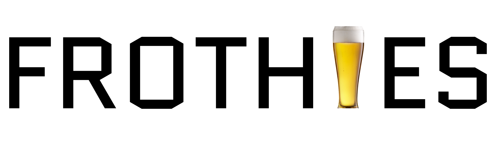

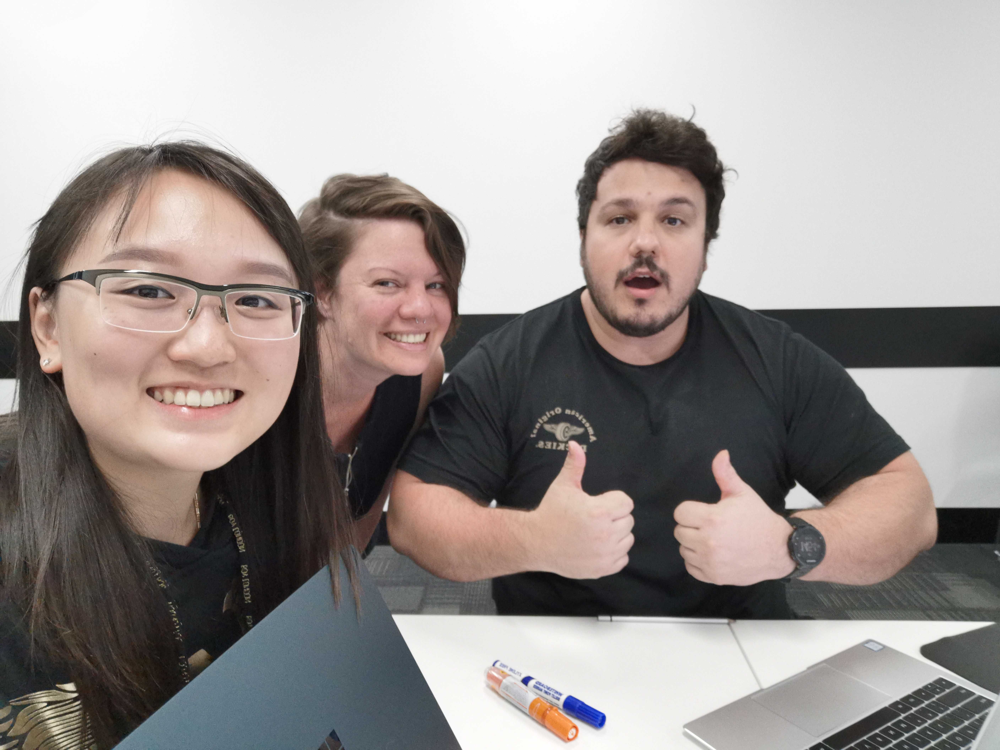
Frothies developers, Jie-Yi, Gwenny, and Rastko 

# Rails app 
This rails app was created as part of assessment for Coder Academy Fasttrack Bootcamp over two weeks in April, 2019. Relevant links for the project are listed below. 

Trello: https://trello.com/b/bqhyTEfY

Heroku site: https://enigmatic-shelf-88976.herokuapp.com/

Github repo: https://github.com/rastko909/frothies

Figma moodboard and wireframes: https://www.figma.com/file/aPgYx1QKRcH5hHLC6htyxhyK/Frothies?node-id=24%3A0

Google slides User Personas: https://docs.google.com/presentation/d/1MiDaYOKiY3vW1_pMVOsPU4bY29DUTXa0rsX3hkpEaX4/edit?usp=sharing

Cardboard User Stories: https://app.cardboardit.com/maps/guests/f9c1bdb994a2426b642e43ccab0b20034ce0e5109cab39e661aa8c13424756b4

**Instructions for running the app**

To run the Frothies app, please complete the following steps.
1. Visit the Heroku site for [Frothies](https://enigmatic-shelf-88976.herokuapp.com/).
2. Test the site by creating an account or using the existing account details provided in the Logins section below this section.

Functionality included in the app you can test includes
- logging in (logins provided below)
- creating new user account
- creating new vendor account
- as an existing vendor
  - adding products and uploading an image
  - editing products
  - deleting products 
  - editing vendor profile
- as an existing user
  - editing profile
  - creating new orders
  - paying for orders as a test purchase
  - seeing order history.

**Logins to use for testing**

Note to markers: please use the following User login to login to Frothies website and gmail. There is an optional vendor and mailgun account as well.

*User (Buyer) details*
Buyer account: frothies.customer@gmail.com
Password: Frothies-123
Note: this account is seeded and is listed as an authorised recipient for Mailgun. You may login to Frothies using these details and login to gmail using the same details to check the mailgun verification after test order purchase.

*Vendor details*
Vendor account: frothies.vendor@gmail.com
Password: Frothies-123
Note: this account is not seeded. Instructor can register as a brewer on Frothies app using these details, or if preferred can register using their own details.

*Mailgun account*
If you would like to add any other authorised mailgun recipients to test emails, use the following details.
Login: frothies.application@gmail.com
Password: 

**What does this readme contain?**

As per deliverable requirements, the short answer questions are listed below with individual headings and responses. Following these is our record of project management throughout the project.

# Short answer questions
## 1. What is the need (i.e. challenge) that you will be addressing in your project?

In the beer industry, we identified that microbreweries are stretched for time and resources and find themselves in an increasingly saturated market. We recognised a strong need for them to diversify their customer base if they are to survive and keep the art of craft beer alive. 

At the same time, our target customers from Generation X, Y and Z have a passion for good quality craft beer. They also want to support local businesses and try new craft beers. In fact, the 2018 Australian Craft Beer survey by Beer Cartel found that the majority of craft beer lovers actively look for new craft beers to try and that 85% of Australians are purchasing more Australian craft beer and less international craft beer. However, these people may not always have the time to search for or visit such microbreweries.

We saw an opportunity to connect these two groups of people via an app that acts as a marketplace, relieving time pressure for both parties and bridging the gap between buyer and seller. 

## 2. Identify the problem you’re trying to solve by building this particular marketplace App? Why is it a problem that needs solving?

The business case for this issue is that microbreweries tend to be 'bricks and mortar' physical stores. Such stores traditionally rely on customer visits for tours or tastings for business (stat on tourist industry?). (stat - online?) This means the breweries miss out on the opportunity that digital environments provide and therefore do not pass on this convenience to their customer base nor do they have the chance to widen their market. Because the craft beer industry has soared in popularity, ignoring an opportunity to diversify is now a more serious risk for the microbrewers, and by extension, the local economy.

The app aims to solve this problem before microbreweries and their part in the economy are at risk. 

## 3. Describe the project will you be conducting and how your App will address the needs.

Frothies, the online marketplace we are creating, aims to make the online user experience simple and straightforward. This will save time for busy brewery owners, because they'll be able to get immediate data on their products without doing the analytics manually. In addition, their products will be introduced to a larger online audience outside their local area without them having to pay for advertising or use their resources to travel to different areas to sell.

For the buyers in our marketplace, the project will provide a convenient online environment that allows them to support microbreweries without having to spend time searching for them or travelling to them. We bring the beer tasting directly to their front door. 

## 4. Describe the network infrastructure the App may be based on.

The Frothies app runs on Heroku, a cloud-based platform as a service (PaaS) that hosts web applications. 

Heroku runs by using dynos, which are separate containers that run the app's code. A dyno is esentially a small virtual computer.

Heroku has its own router that goes between dynos and app users. For example, if we type in our Frothies URL, a DNS request is sent to our provider, which directs the user's computer to the Heroku routers. 

To get our app's code onto dynos, a process Heroku calls 'slug compilation' happens. This process is known as a release, which is a our application code (i.e. a slug) and the code's configuration. 

## 5. Identify and describe the software to be used in your App.

The Frothies web application was built using the following software.

*Ruby*

Ruby is the main programming language that Frothies is built with.
*Rails*

Rails is an open source development framework for web applications written in Ruby. As a model-view-controller framework, it provides the database structure, . Ultimately, it communicates with Rack, the middleware communicating directly with the web server.

*HTML*

Hypertext Markup Language was used for the structure of Frothies pages with embedded ruby (erb)—HTML with Ruby code inside it. This allowed the development to include Ruby functionality in a format that the code could output a pure HTML file. 

*CSS*
Cascading Style Sheets were used to style the Frothies web pages. We used SCSS, a superset of CSS, so that we were able to extend the functionality of CSS, including by storing styles as variables and nesting. Many of our pages had Bootstrap 4 elements, which also required SCSS files to be used. 

*Javascript*

We used Javascript, an object-oriented programming langauge for web desing, for dynamic parts of the site, such as replacing our Stripe payment button and hiding inputs and labels when a user signs up. 

## 6. Identify the database to be used in your App and provide a justification for your choice.

Although the default database for Rails apps is MySQL, we followed the recommendation from staff to use PostgreSQL since it works better with Heroku. Postgres is native to Heroku while MySQL requires workarounds. A quote from a [Heroku blog](ttps://blog.heroku.com/postgresql9-public-beta) states 'At Heroku, we believe PostgreSQL offers the best mix of powerful features, data integrity, speed, standards compliance, and open-source code of any SQL database on the planet.' 

## 7. Identify and describe the production database setup (i.e. postgres instance).

We used the default settings for almost all of the database setup. This meant it was, as per Ruby on Rails apps, running off Rack. Rack is a middleware that executes our Ruby code, starting with reading and running the config.ru file (.ru being a naming convention for Rack files). We changed two settings for production (i.e. in our production.rb file). 

We set our storage for images to be Amazon so we could use cloud-based storage via S3 for some of our images. We included these details in the storage.yml file. 

## 8. Describe the architecture of your App.

As per Rails apps, Frothies utilises the model-view-conroller framework. This architecture has a 'separation of concerns' where each section is responsible for different parts of an app. 

**Model** is the part responsible for functionality and data (i.e. deals with the database)

**View** is the information that the user can see and interact with

**Controller** is what handles the user's inputs

Entering our URL in a browser will send a request to a web server. Using resources, we are able to create RESTful routes for our components and generate paths in our app.

Once the server receives a request, it will map the URL path to the controller it needs (e.g. to create or edit a login from a user) and the view part of the app will render a page where the user sees a  certain page, in this case a login page. Once a user logs in or signs up for example, the model comes into play, getting all users from the database and rendering the home page to the user with their user account details rendering on the page. 

## 9. Explain the different high-level components (abstractions) in your App.

Our app is built on Rails, a Domain Specific Language (DSL) which is itself written in Ruby. For the computer to understand our Ruby on Rails app, Ruby is translated into C, a low-level language, low-level being a language with less abstraction that is closer to machine code. C is then translated into the binary that the machine needs to run it. 

One significant level of abstraction in Rails is the routes. The routes allow our app to match requests (e.g. GET, POST) to an action in the controller. Ultimately, this will direct the user to a URL, and because of this abstraction, we are not required to hard code the URLs or routes as strings.

Another level of abstraction is how active records work. The way active storage works in Rails is abstracted for the user. 
 
## 10. Detail any third party services that your App will use.

Frothies used several third party services, as listed below. 

*Devise*
Devise is a gem used for authentication. Built on Warden, it is a Rack application that handles cookies to verify the identity of a user, simultaneously hiding the user's unique id. In Frothies, this can be seen throughout the code with current_user.

*Cancan*
CanCanCan was used in Frothies for authorisation. This allowed users to have different levels of access to Frothies information. Access levels were as follows.
- Buyer: can create/edit their profile, can view products, can edit/delete their orders, can view their payment history
- Vendor: can create/edit their profile, can create/edit/delete products, can see a buyer's order history, 
- Admin: this would be a superuser. We did not have the scope to develop this admin role for the MVP.

Code snippet showing Cancan abilities
      user ||= User.new # guest user (not logged in)
      if user.is_admin?
        can :manage, :all
      elsif user.is_vendor?
        can :manage, Product
        can :manage, Vendor
        can :manage, User
      else
        can :read, Product 
      end

*Stripe*
Stripe software was used to handle our payment system. The setup of Stripe is more developer-friendly and provides secure payment processing by 'tokenising' credit card numbers and avoiding exposing server data. This is a part of Payment Card Industry Data Security Standard (PCI DSS), the 12 security controls a business is required to implement to be compliant in Australia. 

*AWS*
Amazon Simple Storage Service (S3), an AWS object storage service, was used for cloud-storage to allow the uploading and storing of images via a secure and reliable platform. 

## 11. Describe (in general terms) the data structure of marketplace apps that are similar to your own (e.g. eBay, Airbnb).

As we developed Frothies to be a buyer / seller marketplace, the way data is organised is similar in some ways to other e-commerce platforms. 

Ebay: The models are similar (buyer / seller) although in eBay buyers can also be sellers, whereas in Frothies, the model and relations require users to be a buyer or seller, not both simultaneously. 

Airbnb: Like eBay, the model of buyer/seller is similar in Frothies, but the peer to peer (i.e. buyer/seller can be the same person) aspect of the model is not. 

## 12. Discuss the database relations to be implemented.

In Frothies, there was only a need for one to one and one to many relations to be implemented. We did not require many to many.

## 13. Describe your project’s models in terms of the relationships (active record associations) they have with each other.

Between our Frothies Active Record models, the associations are as follows.

Buyer (i.e. User in Frothies development environment)
  has_one :vendor
  has_many :orders
  has_many :order_items

Seller (i.e. Vendor in Frothies development environment)
  belongs_to :user
  has_many :products
  has_one_attached :company_logo
  has_many :order_items

Product (the item a vendor is selling)
  belongs_to :vendor
  has_many :order_items
  has_one_attached :image_url

Order (a buyer's list of order items once they have clicked 'Checkout')
  has_many :order_items
  belongs_to :user, optional: true

Order items (products after a buyer has ordered them)
  belongs_to :order, optional: true
  belongs_to :product
  belongs_to :user, optional: true
  belongs_to :vendor, optional: true

## 14. Provide your database schema design.

*Screenshot of Entity Relationship Diagram (ERD)*

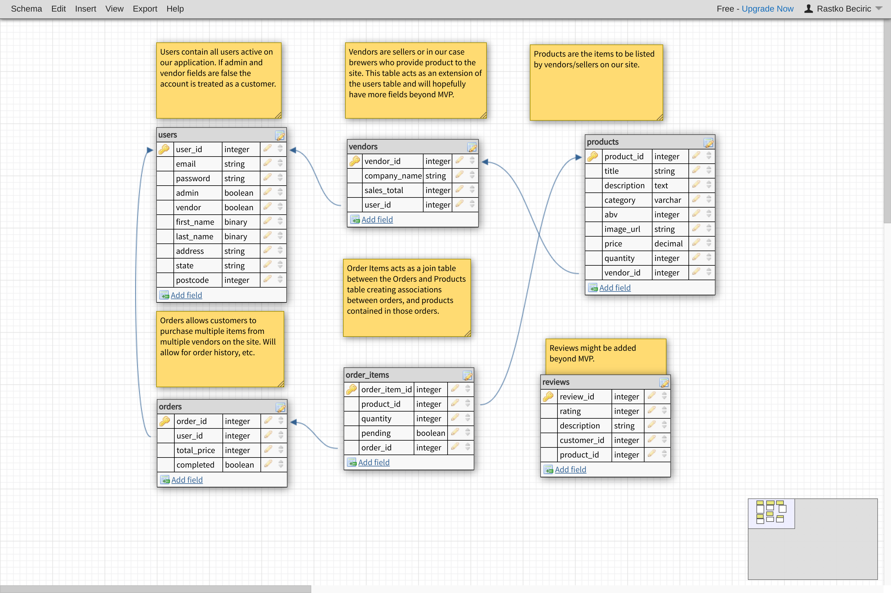

## 15. Provide User stories for your App.

We created user stories for two types of users
- a buyer
- a seller (i.e. a microbrewery owner or manager).

We used an Agile approach to our stories, having epics for our broad concepts, features to distinguish technical parts of the stories, and user stories for specific use cases. We displayed these on cards using Cardboard as our User Story mapping tool. 

We came up with 8 user stories for our MVP and a few more for a 2nd iteration if we had the MVP completed. 

The user stories for our MVP are listed below and can be seen in the screenshot.

As a buyer, I want to
  - sign up so I can create an account
  - add products to my card so I can buy them
  - view products in my cart before I buy them so I can check what I ordered
  - store the products I placed in my cart so I can view them at a later time.

As a seller, I want to
- display products so I can show them to customers
- see orders so I can prepare them for delivery
- have buttons for customers to click on so I can sell my products
- update the status of orders so customers are happy (e.g. shipped).

We managed to develop all of our MVP features for our User stories.

*User story mapping using [Cardboard](https://cardboardit.com/)*

## 16. Provide Wireframes for your App.

We developed wireframes for our app using Figma. The wireframes were for mobile phone, tablet and desktop views.

We designed the following screens.
- ID check page (for over 18)
- Page for rejection if under 18
- Home page (displaying products)
- Login/Sign up page
- Sales summary for vendor (i.e. vendor dashboard) page
- Sales summary for buyer (i.e. order summary) page

*Wireframes for desktop*

*Wireframes for tablet*

*Wireframes for mobile phone*

## 17. Describe the way tasks are allocated and tracked in your project.

We communicated throughout each day about how we would allocate tasks. To communicate, we talked in person to kick off each day, throughout the day as required in person as well as in Slack to share files or code snippets (screenshot below) and via Trello for task allocation. 

*Communication channel in slack*

*Sharing code and files in slack*

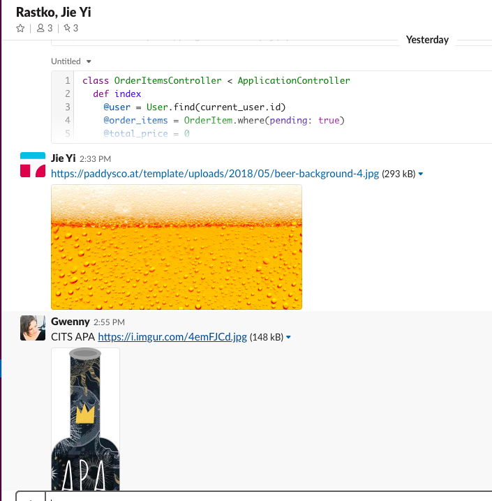

## 18. Discuss how Agile methodology is being implemented in your project.

We used Agile methodology concepts in several ways, including
- Kanban (Trello)
- Scrum framework
- User story mapping

**Kanban**

We maintained an agile (Kanban) board on Trello for project management with cards, columns, work-in-progress limits (3 for In Progress column), a backlog that we groomed, and a delivery point throughout the project. 

For the first four days, we're using Kanban, and for the 5th to the 8th day, we plan to use Scrum while keeping our backlog (i.e. 'Scrumban'). 

Screenshots of the Kanban are shown throughout our planning notes after this short answer question section. On day 10, the board looked like this:

*Screenshot of Trello board, Day 10*

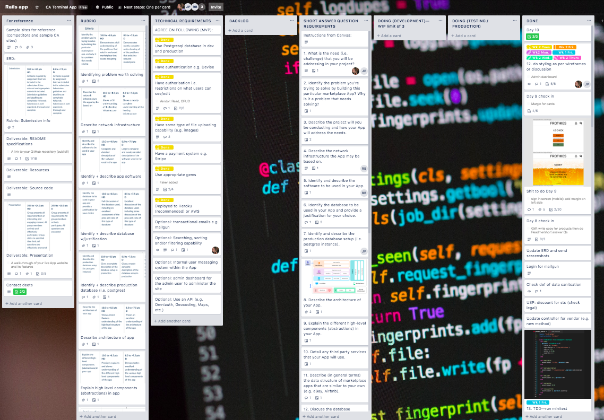

The headings for Kanban are shown here:

*Kanban headings to support Scrum iterations*

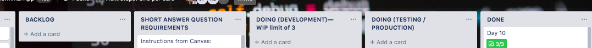

During the scrum, we planned to
- prioritise tasks from our backlog
- do sprint planning as a group
- have two shipped epics as our scrum goals.

We created User stories early in the project as part of our planning and used these during sprints to complete features we hadn't done while maintaining a fast, efficient development pace. 

We also followed customer journeys using the cards and inbuilt function in the site. One customer jouney is shown in the screenshot below.

*Example customer journey from user story map*

While we attempted to use the scrum framework, we didn't have the formal roles from agile such as scrum master, instead sharing these roles fluidly between us.

We used the concept of User stories and User story mapping but we didn't strictly measure velocity as this sprint was for this one project and would not be repeated with the same development team again.

## 19. Provide an overview and description of your Source control process.

From day 1, all group members set up a local branch for Github repository, Frothies.

The group agreed that each time changes made worked locally (e.g. features were added or models changed), we pushed to Github from our local branch and created a pull request then merged to Master branch. Other group members would then pull the master and merge master for their local copy of the app. 

Approval was always agreed on between the three group members for this process. Confirming the merge was sometimes a different person to the person that pushed the changes to Github, but in some cases when we were all together, it may have been the person who pushed to Github creating the pull request and confirming. 

## 20. Provide an overview and description of your Testing process.

We did testing at different levels during the app development. 

This included testing as we developed each feature to see how it worked and also trying edge cases each time. For example, when we added authorisation, we tested different logins for different users to check that the authorisation behaved as expected. Screenshots of different testing is shown below.

*Screenshots of testing during app development*

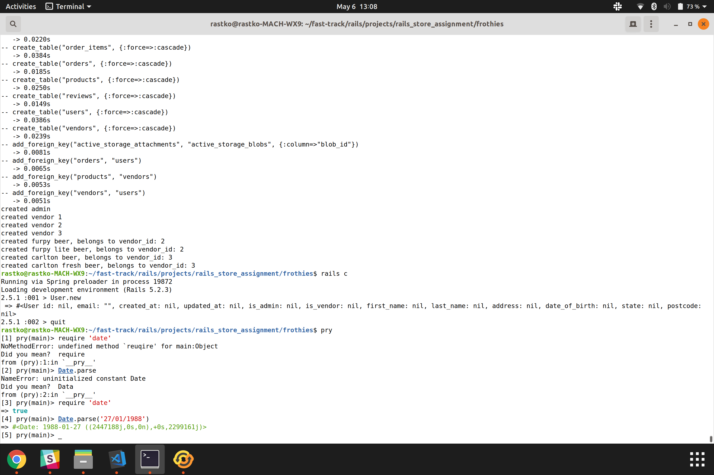

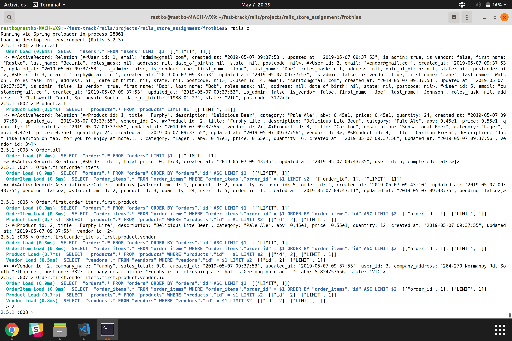

We also deployed to Heroku and tested using 'raise' by entering variables and checking output was as expected. For example, after deploying the products home page, we tested that we could create, save and retrieve objects using 
- e = User.new
- e.save
- e.title

We agreed to use Minitest for unit testing since it is the default for Ruby libraries and has the inbuilt test files. We did one set of testing around product, since this was our main component on the app. 

We received one error to do with 'image_url' and tried several strategies to get rid of it (deleting the relation 'has_one_attached' from the products model, manually editing the image_url when seeding), none of which removed the errror. As this was the only error we were getting and the app was still deploying successfully, we agreed to move on. 

*Screenshot of product test*

*Screenshot of testing error*

## 21. Discuss and analyse requirements related to information system security.

The three main requirements of information system security is to maintain confidentiality of data, preserve the integrity of data and promote the availability of data for authorized use. These three goals must be considered when creating a plan to protect a computer system.

Confidentiality of data refers to protecting data from being accessed by unauthorized parties. Only authorized users should be able to access data in the system.

Integrity of data refers to the authencity of data in the system - whether information is accurate. Only authorized users can make modifications to the data and even so any improper modifications to the data should be prevented.

Availability of data refers to whether information are accessible by authorized users. In an event of an emergency (intentional attacks or natural disasters) where it may result in a loss of information system capabilities, there should be a disaster recovery plan in place to ensure data is not lost. Encrypted data could also be stored on the internet/digital media.

## 22. Discuss methods you will use to protect information and data.

According to the Australian government business cyber security site ([2019](https://www.business.gov.au/risk-management/cyber-security/protecting-your-customers-information)), the following responsibilities are best practice for storing customer data. 

'As a business owner, you have the responsibility to:

Protect personal information from:
- theft
- misuse
- interference
- loss
- unauthorised access
- modification
- disclosure.
Take reasonable steps to destroy or de-identify personal information when it is no longer needed for any purpose permitted under the Privacy Act 1988. This might include shredding documents or storing them in a secure area.'

We protected our users' data by employing validation, authorisation, authentication and secure and reputable third party services in the development of our app. 

## 23. Research what your legal obligations are in relation to handling user data.

The Privacy Act 1988 regulates the management, storing, access and correction of personal information about individuals that is handled by APP entities. Business with an annual turnover of more than $3 million, health service providers and those who trade in personal information for benefit, service or advantage are considered an APP entity and are covered by the Privacy Act 1988.

Our app does not fall under these categories and therefore does not have responsibilities under this part of the Privacy Act.

However, under the Section 6EA of the Privacy Act, we could decide to opt-in and be covered by the Privacy Act as a public committment to good privacy practice. Operating under the Privacy Act may result in an increase in customer confidence and trust in the business.

# Project Management

We managed the project daily, keeping records of all decisions and meetings in Trello and also summarised everything here as a record.

# Day 1

**Morning plan**

- JP + RB go through test app deployment / Stripe / Cancan / Devise
- GW set up Trello w/Rubric

**Middle of day check in**

Meeting to agree on MVP / roles / day 1 and 2 plan
- Completed basic wireframes on board (see screenshot)
  - Home pages (same for all users)
    - Pop up w/age check
    - Landing page
  - Login page 
    - has sign up option
    - asks if buyer or seller
  - Buyer home page
  - Seller dashboard
  - Admin dashboard
- Agreed on accounts required for MVP (Buyer, Seller, Admin, Guest)
- Agreed on Day 1 + 2 plan
  - GW do Readme/Trello
  - JP do research on screenshots
  - RB do ERD
Photo of Day 1 meeting board

Trello at start of Day 1

**Schema design**

RB worked on the schema more and completed the ERD. The ERD changed during the day as we refined the schema design, as shown in the screenshots comparing the start of the day and the end of the day.

*Screenshots of ERD at start of Day 2*

*Screenshots of ERD at end of Day 2*

*Trello at end of Day 1*

*Screenshot of migrating and implementing bootstrap*

*Heroku home page deployed at end of Day 1*

# Day 2

**Morning check in**

Group agrees
- RB had updated the ERD overnight and wanted to continue, so he'll work on that for the morning. 
- GW to update Trello after check in, complete linking cards in Trello and check requirements are on track 
- JP continuing research for wireframes
- group completed WIP and gave following update:

Notes from WIP and morning plan

*Screenshot of Day 2 morning planning using Kanban backlog*

*Trello board at start of Day 2*

**Debugging**
We continued adding to the controllers and models. We did debugging throughout the day. 

*Example of debugging*

**Wireframes**
We completed wireframes for two devices and agreed to design for mobile first, so started with those once in Figma. 

After agreeing on the colour scheme and feel we wanted for the brand, JP created a moodboard then moved onto wireframes. 

Changes:
We discussed UI design and made a few changes, namely
- moving icons for navigation to bottom of mobile UI so that there was more space between them and they were in the hot zone
- moving nav pane on desktop to all be on the same side rather than on two sides to reduce visual clutter, make the information hierarchy more obvious and keep the UI clean

*Lo-fi wireframes*

*Figma moodboard*

*Wireframes in Figma*

Wireframes for mobile were completed first, as we agreed that designing for mobile-first was the best option for our users and for the wider trend in society preferencing mobile use.

*Screenshot of mobile wireframes*

Wireframes for desktop were completed next, as our sellers would most likely operate from desktop at least some of the time, as might buyers.

*Screenshot of desktop wireframes*

By the end of day 2, we completed all our tasks as agreed in the morning and midday check ins. 

*Screenshot of End of day 2 Trello card*

*Start of Day 3 trello*

**Day 3 priorities**
1. Be able to retrieve objects and complete one transaction, deploy to Heroku
2. Start work on short answer questions
If done early, then: 
- Testing
- Stripe
- CanCan

**Middle of day update**
1. Objects can be retrieved
2. We've started on short answer questions and will do more together as a group starting after lunch
   Other:
   - we've researched testing and will start with minitest
   - we've got wireframes for two devices, now working on a third

**Wireframes**
Wireframes were completed for a third device—iPad.

*Screenshot of iPad wireframes*

**End of day 3 update**
RB/JP stayed late and worked our order system
All MVP features for buyer now working as per user stories, i.e.
- sign up
- add products to cart
- store products in cart (i.e. be able to log out and log back in and see the products there still)
- view products in cart

Third device wireframes are done

*Updated wireframes for Ipad*

Details of end of day 3 check in in Trello card screenshot below. 

*Screenshot of End of day 3 update*

# Day 4

*Day 4 planning meeting*
We agreed to get the rest of the MVP requirements added in today and tomorrow if required. There is Stripe, Cancan, and AWS image uploading remaining for the technical requirements (see previous screenshot End of Day 3 update in Trello). 

Authorisation 

We revised authorisation and decided to implement six abilities in total in week 1 using Cancan. We'll use the Cancan shortcuts (e.g. Read for :show, :index, :to). We also planned further authorisation to add in in week  (see screenshot below).

*Authorisation planning*

*Authorisation brainstorm*

*End of Day 4 update*

At the end of Day 4, we had Stripe working, had added image uploading, and had organised the master key for all group members to have locally. Rastko 

**Day 5**

*Day 5 planning*

![Screenshot of Trello board at start of day 5]

*Trello at end of day 5*

![Screenshot of Trello board at end of day 5]

**Day 6**

Start of Day 6 planning
- Retro on week 1
- Go through rubric and identify gaps / priorities for the next few days

We wanted to start day 6 by re-evaluating where we were at and also making sure everyone was on the same page in terms of understanding the data structure and code, as shown in the picture of our Trello card below.

We started the day by completing a retrospective on the past week. We did a two minute ideation on 'What worked well' then discussed each item (picture of board below).

*Photo of retro—what worked well*

In general, we agreed that a lot of the MVP features had gone well, as had our communication and planning.

Next, we did a two minute ideation on 'What didn't work well', and went through those individually (picture of board below).

*Photo of retro—what to improve*

We identified some similar and some different challenges. We agreed that we needed to put more time into answering short answer questions, based on the length of time they had taken in week 1. 

Finally, we discussed how we could shift or solve all of the challenges that came up in our 'What didn't work well' ideation. 

*Photo of retro—solutions*

We prioritised technical challenges in our workflow for day 6 and 7, and agreed to go over how MVC is working in the app to make sure we all understood the code we hadn't worked on. 

Revision of ERD

Rastko wanted to test Gwenny and Jieyi on how well they understood the ERD since he had designed the bulk of it. We drew the ERD as we understood it (most important relations, see first picture below), and afterwards, he talked us through his understanding afterwards (see second picture below).

*Gwenny and Jieyi's ERD*

*Rastko explaining how he saw our ERD*

*Rastko's explanation of ERD*

*Trello in middle of day 6*

Check in at end of day 6

At the end of day 6, we went over what had been completed for the day and what we aimed to do next, as shown in the image of the Trello card below. We agreed we wanted to have a 'shippable' product by Friday, and planned to do products, design and still some work on user flow.

*Trello cards at end of day 6*

*Tasks completed:*

**Day 7**

*Morning of Day 7 planning*

We checked in in the morning as RB had done work overnight. He had improved the user flow and added more functionality. 

*Trello card at start of day 7*

Gwenny wrote copy for our 3 microbreweries for Rastko to include on brewer profile views (see screenshot) then trialled adding a search button to the site using bootstrap. It was difficult styling bootstrap and unpacking previous code (see screenshot below of testing). 

*Screenshot of copy for microbreweries*

*Screenshot of testing design with search box*

Jieyi finalised bottle design for individual products including branding for each microbrewery. 

*Screenshot of product designs for microbreweries*

**Day 8**

*Morning of Day 8 planning*

In the morning of Day 8, we started with a drop down menu that Rastko had added in last night. We agreed he would continue refining user flow and adding our features for vendors like:
- marking an order as shipped
- sending an email verification from Frothies to users after payment
- sending an email to users from a vendor when order shipped

*Screenshot of Day 8 plan*

*Screenshot of Trello board at start of day 8*

Jieyi will continue with designing products (see screenshot) then UI of the site. We tried several designs e.g. with logo at top, at bottom, with block colour background, and then Jieyi designed as she felt worked.

Gwenny wrote copy for the 12 individual products (see screenshot). We agreed on having a short description for cards and a longer description in case we get a product view implemented that allows more text. We also added one product for one brewery, so there were 13 products in total.

*Screenshot of an extract of copy written for products*

*Designing product looks (including drink names and logo for brewery)*

**Day 9**

*Day 9 planning*

We developed the presentation slide deck and themed it to match our Frothies site. 

*Screenshot of slide deck*

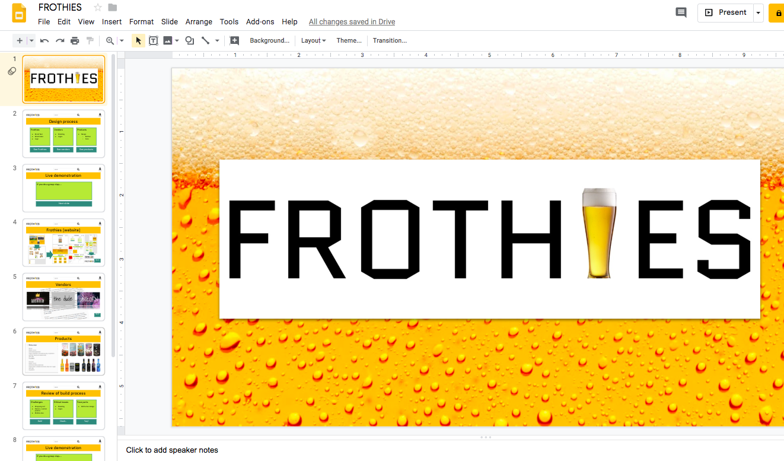

**Day 10**

We agreed that our white background and general styling was too minimal and experimented with images for our background. We settled on an image of graffiti from Unsplash that had the right feel for our users and the craft beer industry.

*Image sourced from Unsplash for background*

*Frothies home page with image background*

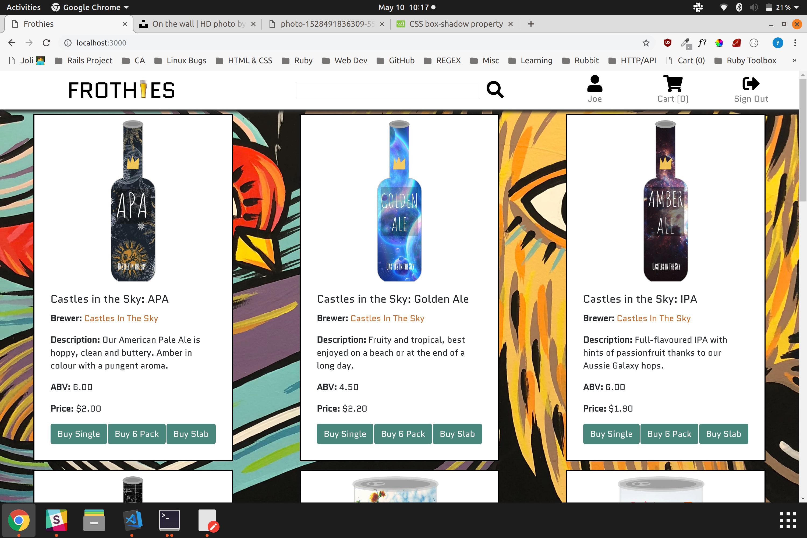

After playing around with colours, we settled on the final design with purple buttons and hyperlinks. 

*Frothies home page, final design*

Our planning was to tie up loose ends today and finish our documentation.

*Screenshot of Day 10 plan*

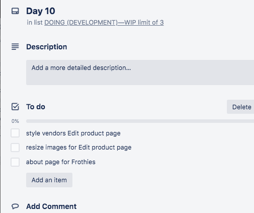

*Screenshot of Trello board at end of project*

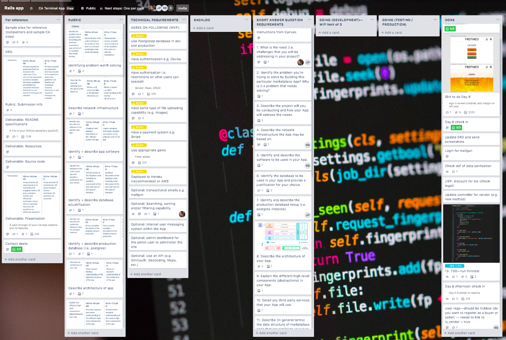

*Sad because it's over*

*Also happy because it's over*

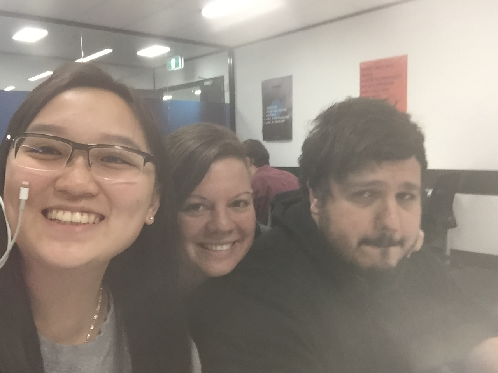